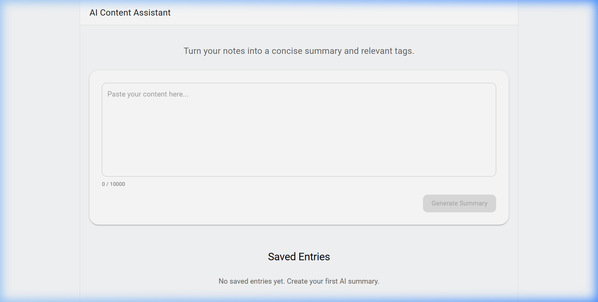
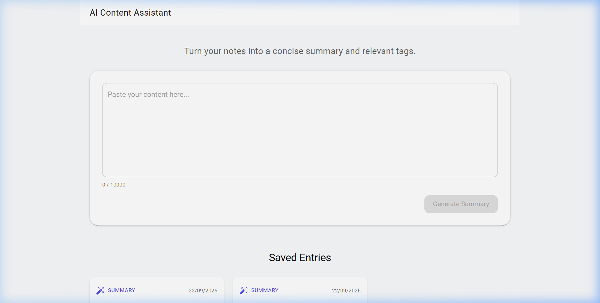
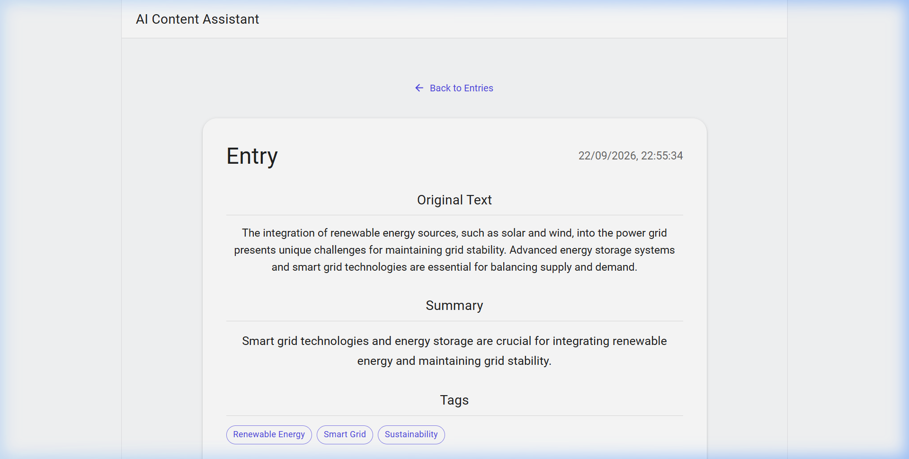

# AI Content Assistant

## Overview

The AI Content Assistant is a full-stack application that transforms raw user notes into concise summaries and extracts exactly three relevant tags. It provides a clean, responsive interface to save these entries persistently to a database, allowing users to browse their past insights seamlessly. 

## Tech Stack

Frontend:
- React
- Vite
- Material UI

Backend:
- Node.js
- Express
- Prisma
- SQLite

AI:
- Google Gemini
- @google/genai

## Features

- Submit text up to 10,000 characters for AI analysis.
- Receive a concise 1-2 sentence AI-generated summary.
- Receive exactly 3 unique AI-generated tags.
- View a persistent list of saved entries, ordered newest first.
- View individual entry details containing the summary, tags, and original text.
- Full UI error handling for network, validation, and AI failures.

## Architecture

React frontend
→ Express API
→ validation
→ Gemini
→ AI response validation
→ Prisma
→ SQLite
→ response to frontend

## Setup

Backend:
```bash
cd backend
npm install
npx prisma db push
npm run dev
```

Frontend:
```bash
cd frontend
npm install
npm run dev
```

You must configure the `.env` file in the `backend/` directory by copying `.env.example` to `.env` before running the backend. This file securely provides the required API keys and configuration constants.

## Environment Variables

```env
GEMINI_API_KEY=
GEMINI_MODEL=
PORT=
DATABASE_URL=
FRONTEND_URL=
VITE_API_URL=
```

## API

### `POST /entries`
Analyzes the text and creates a new entry.
**Request:**
```json
{
  "text": "The quick brown fox jumps over the lazy dog."
}
```
**Response (201 Created):**
```json
{
  "id": 1,
  "originalText": "The quick brown fox jumps over the lazy dog.",
  "summary": "A fox quickly jumps over a dog.",
  "tags": ["fox", "dog", "jump"],
  "createdAt": "2024-01-01T12:00:00Z"
}
```

### `GET /entries`
Retrieves all saved entries, ordered newest first.
**Response (200 OK):**
```json
[
  {
    "id": 1,
    "originalText": "The quick brown fox jumps over the lazy dog.",
    "summary": "A fox quickly jumps over a dog.",
    "tags": ["fox", "dog", "jump"],
    "createdAt": "2024-01-01T12:00:00Z"
  }
]
```

### `GET /entries/:id`
Retrieves a single entry by its ID.
**Response (200 OK):**
```json
{
  "id": 1,
  "originalText": "The quick brown fox jumps over the lazy dog.",
  "summary": "A fox quickly jumps over a dog.",
  "tags": ["fox", "dog", "jump"],
  "createdAt": "2024-01-01T12:00:00Z"
}
```

### `GET /health`
Returns the status of the API.
**Response (200 OK):**
```json
{
  "status": "ok",
  "timestamp": "2024-01-01T12:00:00.000Z"
}
```

## AI Choice

Google Gemini was selected for its fast performance, generous free tier, and robust native support for structured JSON generation via `responseMimeType: 'application/json'`. This removes the need for unpredictable regex parsing and allows the `@google/genai` SDK to cleanly return deterministic objects every time.

## Reliability

User inputs are securely validated using Zod to ensure maximum lengths and formats are respected before hitting the API. The Gemini integration implements a strict timeout and wraps all network errors, while returning safe fallback messages. Outbound AI responses are strictly validated post-generation to guarantee exactly 3 tags and a valid summary are present before persisting.

## Privacy

User-submitted text is transmitted verbatim over an encrypted connection to Google's Gemini API for processing. In a financial-services production environment, sensitive personal, financial, authentication, or confidential information should be minimized, redacted, or otherwise handled according to approved data-governance controls before sending it to an external model provider.

## Production Next Steps

- Implement authentication/authorization and user-level data isolation.
- Configure stronger observability, request rate limiting, and exponential AI retries.
- Implement strict privacy controls, provider configuration agreements, and migrate to a production database (e.g., PostgreSQL).

## Testing

The backend includes automated tests covering API endpoints and validation constraints.
Run the test suite via the `backend` directory:
```bash
npm test
```

## AI Coding Tools

Antigravity (a deep-learning based agent) was used to assist in writing scaffolding and React implementations. The generated code was not blindly accepted; it was reviewed, thoroughly tested, and modified line-by-line to ensure stability, proper error handling, and strict adherence to the project specifications.

## Screenshots

### Empty State


### Populated Data State


